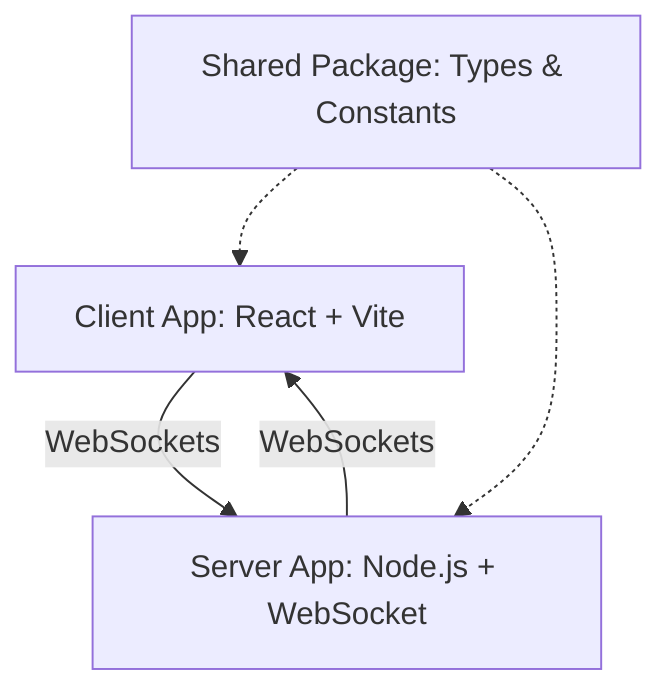

# PlanItPoker

A real-time planning poker application designed for agile teams to estimate tasks. This project is structured as an npm workspaces monorepo containing a React frontend, a Node.js backend, and a shared types package.

## Architecture

The application uses a client-server model communicating over WebSockets for real-time state synchronization.

### Monorepo Structure

- **`apps/client`**: The frontend application. Built with React, Vite, and Tailwind CSS. It uses native WebSocket to connect to the backend.
- **`apps/server`**: The backend server. Built with Node.js, Express, and native WebSocket (`ws`). It manages the state of all active rooms and handles WebSocket connections.
- **`packages/shared`**: A shared library containing TypeScript interfaces, enums, and constants used by both the client and server.

### System Diagram



## Requirements and Features

The application supports multiple users connecting to a single room to vote on task estimates. Users can hold different roles within a room, which dictate their permissions.

### User Roles

1.  **Administrator**: The creator of the room. Possesses full control over the room settings and participants.
2.  **Co-host**: Appointed by the Administrator. Possesses the same management permissions as the Administrator, except for transferring the primary Administrator role.
3.  **Voter**: A standard participant who can submit votes on active tasks.
4.  **Spectator**: A participant who can observe the room activity but cannot submit votes.

### Functionalities

- **Standard Features**:
    - Join a room using a unique URL.
    - Select a card to submit an estimate.
    - Toggle personal status between Voter and Spectator.
    - View the current story backlog.
    - **Full Responsiveness**: Access and interact seamlessly across mobile devices, tablets, and desktops.

- **Administrative Features** (Restricted to Admin and Co-host):
    - **Room Settings**: Rename the room, lock/unlock the room to prevent new joins, and change the estimation deck type (e.g., Fibonacci, T-Shirt sizes).
    - **Participant Management**: Kick users from the room, promote users to Co-host, and transfer the primary Administrator role.
    - **Voting Control**: Reveal all submitted votes, reset the current voting session, and finalize the agreed-upon estimate (automated average/mode or custom manual override) with automatic progression to the next backlog story.
    - **Backlog Management**: Add new stories, delete stories, bulk import stories, and manually edit story estimates.
    - **Time Management**: Start, stop, and manage a synchronized countdown timer for discussions.

### UI & Responsiveness Principles

- **Mobile-First & Multi-Device Support**: All UI components (Navbar, Poker Table, Participant Seats, Card Deck, Estimation Results, Backlog Drawer, and Settings Modals) must be fully responsive across all viewport sizes (from 320px mobile to 4K displays).
- **Fluid & Adaptive Dimensions**: Elements must scale dynamically without causing horizontal scrolling, text clipping, or element collisions.
- **Touch-Friendly Targets**: Controls and cards provide comfortable touch targets and intuitive micro-interactions for mobile and desktop users.

## Build and Run Steps

### Prerequisites

- Node.js (v20 or higher)
- npm

### Installation

1.  Clone the repository.
2.  Navigate to the project root directory.
3.  Install dependencies for all workspaces:

```bash
npm install
```

### Development

To start both the client and server in development mode, run the following command from the root directory:

```bash
npm run dev
```

- The client will be available at `http://localhost:5173`.
- The server will run on `http://localhost:3000`.

### Testing

The project uses Vitest for unit/integration testing and Playwright + Axe-core for E2E and visual validation.

To run the unit/integration test suites across all workspaces:

```bash
npm run test
```

To run tests in a specific workspace:

```bash
npm run test --workspace=apps/server
```

#### End-to-End & Exploratory Visual Testing

The project uses Playwright with `@axe-core/playwright` for comprehensive End-to-End (E2E) testing and exploratory UI element collision/text visibility testing across multiple viewports:

- **Breakpoints Tested**: Mobile (`320px`), Tablet (`768px`), and Desktop (`1280px`).
- **Validation**: Ensures no overlapping interactive/text elements and guarantees full text readability and WCAG accessibility standards.

To execute the full E2E test suite:

```bash
npm --workspace=@planitpoker/e2e run test
```

To run the visual overlap exploratory validation specifically:

```bash
npm --workspace=@planitpoker/e2e run test tests/overlap-axe.spec.ts
```

### Code Formatting and Linting

The project uses ESLint for code quality and Prettier for code formatting. The configurations are integrated so that Prettier handles all stylistic rules without conflicting with ESLint.

To format all files in the repository:

```bash
npx prettier --write .
```

## Deployment (Production)

Deployment is done via **containers**: `apps/server/Dockerfile` (Node 20) and
`apps/client/Dockerfile` (Vite build + Nginx), orchestrated by `docker-compose.yml`.

Build context is always the repository root.

```bash
cp .env.example .env   # adjust ALLOWED_ORIGINS / ports if needed
docker compose up --build
```

- Client: `http://localhost` (Nginx serves the SPA, proxies `/api/*` and `/ws` to `server`).
- Server: `http://localhost:5000` (health at `GET /api/health`).
- Same-origin by default: leave `VITE_WS_URL` empty and the browser uses
  `window.location.host` through the Nginx `/ws` proxy (no CORS setup needed).
- External backend: `VITE_WS_URL=wss://api.exemplo.com docker compose up --build`
  bakes the URL into the client bundle so the browser dials it directly.

Individual images:

```bash
docker build -f apps/server/Dockerfile -t planitpoker-server .
docker build -f apps/client/Dockerfile -t planitpoker-client .
docker build -f apps/client/Dockerfile --build-arg VITE_WS_URL=wss://api.exemplo.com -t planitpoker-client .
```
