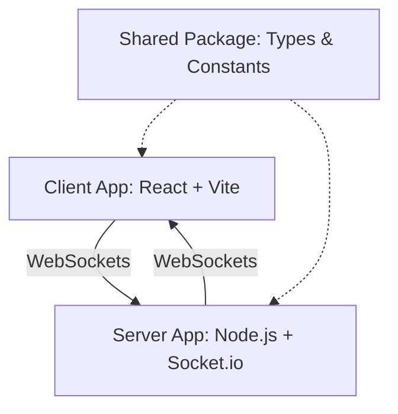

# PlanItPoker

A real-time planning poker application designed for agile teams to estimate tasks. This project is structured as an npm workspaces monorepo containing a React frontend, a Node.js backend, and a shared types package.

## Architecture

The application uses a client-server model communicating over WebSockets for real-time state synchronization.

### Monorepo Structure

- **`apps/client`**: The frontend application. Built with React, Vite, and Tailwind CSS. It uses `socket.io-client` to connect to the backend.
- **`apps/server`**: The backend server. Built with Node.js, Express, and `socket.io`. It manages the state of all active rooms and handles WebSocket connections.
- **`packages/shared`**: A shared library containing TypeScript interfaces, enums, and constants used by both the client and server.

### System Diagram



## Requirements and Features

The application supports multiple users connecting to a single room to vote on task estimates. Users can hold different roles within a room, which dictate their permissions.

### User Roles

1.  **Administrator**: The creator of the room. Possesses full control over the room settings and participants.
2.  **Co-host**: Appointed by the Administrator. Possesses the same management permissions as the Administrator, except for transferring the primary Administrator role.
3.  **Voter**: A standard participant who can submit votes on active tasks.
4.  **Spectator**: A participant who can observe the room activity but cannot submit votes.

### Functionalities

- **Standard Features**:
  - Join a room using a unique URL.
  - Select a card to submit an estimate.
  - Toggle personal status between Voter and Spectator.
  - View the current story backlog.

- **Administrative Features** (Restricted to Admin and Co-host):
  - **Room Settings**: Rename the room, lock/unlock the room to prevent new joins, and change the estimation deck type (e.g., Fibonacci, T-Shirt sizes).
  - **Participant Management**: Kick users from the room, promote users to Co-host, and transfer the primary Administrator role.
  - **Voting Control**: Reveal all submitted votes, reset the current voting session, and finalize the agreed-upon estimate for a task.
  - **Backlog Management**: Add new stories, delete stories, and bulk import stories.
  - **Time Management**: Start, stop, and manage a synchronized countdown timer for discussions.

## Build and Run Steps

### Prerequisites

- Node.js (v18 or higher)
- npm

### Installation

1.  Clone the repository.
2.  Navigate to the project root directory.
3.  Install dependencies for all workspaces:

```bash
npm install
```

### Development

To start both the client and server in development mode, run the following command from the root directory:

```bash
npm run dev
```

- The client will be available at `http://localhost:5173`.
- The server will run on `http://localhost:3000`.

### Testing

The project uses Vitest for testing. To run the test suites across all workspaces:

```bash
npm run test
```

To run tests in a specific workspace:

```bash
npm run test --workspace=apps/server
```

### Code Formatting and Linting

The project uses ESLint for code quality and Prettier for code formatting. The configurations are integrated so that Prettier handles all stylistic rules without conflicting with ESLint.

To format all files in the repository:

```bash
npx prettier --write .
```
